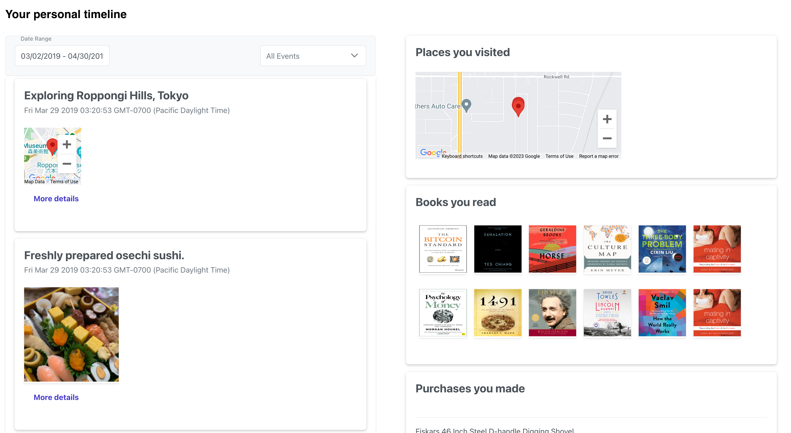
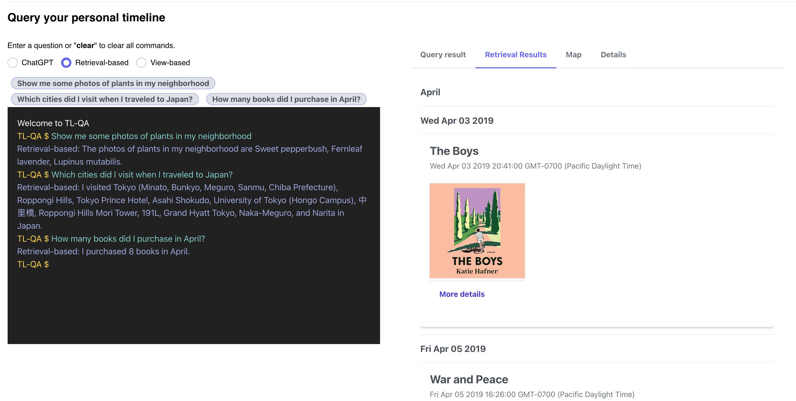

<!-- This file explains how to create LifeLog entries from several data sources. -->

# TimelineBuilder

## Table of Content

- [Setup](#general-setup): how to set up for this repo
- [Importers](#digital-data-importers): how to create LifeLog entries from several data sources.
  - [Dowloading Digital Data](#downloading-your-personal-data)
  - [Running the importers](#running-the-code)
- [Sample Dataset](DATASET.md): a sampled set of anonymized data for testing
- [Data Visualization](#visualization-of-the-personal-timeline): a ReactJS-based visualization frontend of the personal timeline
- [Question Answering](#question-answer-over-the-personal-timeline): a LLM-based QA engine over the personal timeline

## General Setup

## Step 0: Create environment

1. Install Docker Desktop from [this link](https://docs.docker.com/desktop/).

2. Follow install steps and use the Desktop app to start the docker engine.

3. Make sure you have Python3 installed.

4. Run init script
    ```
    sh src/init.sh
    ```
This will create a bunch of files/folders/symlinks needed for running the app.
This will also create a new directory under your home folder `~/personal-data`, the directory where your personal data will reside.

## Step 1: Setting up


## For Data Ingestion

Ingestion configs are controlled via parameters in `conf/ingest.conf` file. The configurations
are defaulted for optimized processing and don't need to be changed. 
You can adjust values for these parameters to run importer with a different configuration.

## For Data visualization

1. To set up a Google Map API (free), follow these [instructions](https://developers.google.com/maps/documentation/embed/quickstart#create-project).

Copy the following lines to `env/frontend.env.list`:
```
GOOGLE_MAP_API=<the API key goes here>
```

2. To embed Spotify, you need to set up a Spotify API (free) following [here](https://developer.spotify.com/dashboard/applications). You need to log in with a spotify account, create a project, and show the `secret`.

Copy the following lines to `env/frontend.env.list`:
```
SPOTIFY_TOKEN=<the token goes here>
SPOTIFY_SECRET=<the secret goes here>
```

## For Question-Answering

Setup an OpenAI API following these [instructions](https://openai.com/api/).

Copy the following lines to `env/frontend.env.list`:
```
OPENAI_API_KEY=<the API key goes here>
```


## Digital Data Importers


## Downloading your personal data

We currently supports 9 data sources. Here is a summary table:

| Digital Services | Instructions                                                                        | Destinations                                                             | Use cases                                              |
|------------------|-------------------------------------------------------------------------------------|--------------------------------------------------------------------------|--------------------------------------------------------|
| Apple Health     | [Link](https://github.com/alonhalevy/personal-timeline#apple-health)  | personal-data/apple-health                                               | Exercise patterns, calorie counts                      |
| Amazon           | [Link](https://github.com/alonhalevy/personal-timeline#amazon)        | personal-data/amazon                                                     | Product recommendation, purchase history summarization |
| Amazon Kindle    | [Link](https://github.com/alonhalevy/personal-timeline#amazon)        | personal-data/amazon-kindle                                              | Book recommendation                                    |
| Spotify          | [Link](https://github.com/alonhalevy/personal-timeline#spotify)       | personal-data/spotify                                                    | Music / streaming recommendation                       |
| Venmo            | [Link](https://github.com/alonhalevy/personal-timeline#venmo)         | personal-data/venmo                                                      | Monthly spend summarization                            |
| Libby            | [Link](https://github.com/alonhalevy/personal-timeline#libby)         | personal-data/libby                                                      | Book recommendation                                    |
| Google Photos    | [Link](https://github.com/alonhalevy/personal-timeline#google-photos) | personal-data/google_photos                                              | Food recommendation, Object detections, and more               |
| Google Location  | [Link](https://github.com/alonhalevy/personal-timeline#google-photos) | personal-data/google-timeline/Location History/Semantic Location History | Location tracking / visualization                      |
| Facebook posts   | [Link](https://github.com/alonhalevy/personal-timeline#facebook-data) | personal-data/facebook                                                   | Question-Answering over FB posts / photos              |

If you have a different data source not listed above, follow the instructions [here](NEW_DATASOURCE.md)
to add this data source to the importer.

### GOOGLE PHOTOS and GOOGLE TIMELINE
<!--1. You need to download your Google photos from [Google Takeout](https://takeout.google.com/).  
The download from Google Takeout would be in multiple zip files. Unzip all the files.

2. It may be the case that some of your photo files are .HEIC. In that case follow the steps below to convert them to .jpeg  
The easiest way to do this on a Mac is:

     -- Select the .HEIC files you want to convert.   
     -- Right click and choose "quick actions" and then you'll have an option to convert the image.  
     -- If you're converting many photos, this may take a few minutes. 

2. Move all the unzipped folders inside `~/personal-data/google_photos/`. There can be any number of sub-folders under `google_photos`.-->

1. You can download your Google photos and location (also gmail, map and google calendar) data from [Google Takeout](https://takeout.google.com/).
2. The download from Google Takeout would be in multiple zip files. Unzip all the files.
3. For Google photos, move all the unzipped folders inside `~/personal-data/google_photos/`. There can be any number of sub-folders under `google_photos`.
4. For Google locations, move the unzipped files to `personal-data/google-timeline/Location History/Semantic Location History`.

### FACEBOOK DATA
1. Go to [Facebook Settings](https://www.facebook.com/settings?tab=your_facebook_information) 
2. Click on <b>Download your information</b> and download FB data in JSON format
3. Unzip the downloaded file and copy the directory `posts` sub-folder to `~/personal-data/facebook`. The `posts` folder would sit directly under the facebook folder.

### APPLE HEALTH
1. Go to the Apple Health app on your phone and ask to export your data. This will create a file called iwatch.xml and that's the input file to the importer.
2. Move the downloaded file to this `~/personal-data/apple-health`

### AMAZON
1. Request your data from Amazon here: https://www.amazon.com/gp/help/customer/display.html?nodeId=GXPU3YPMBZQRWZK2
They say it can take up to 30 days, but it took about 2 days. They'll email you when it's ready.

They separate Amazon purchases from Kindle purchases into two different directories.

The file you need for Amazon purchases is Retail.OrderHistory.1.csv
The file you need for Kindle purchases is Digital Items.csv

2. Move data for amazon purchases to `~/personal-data/amazon` folder and of kindle downloads to `~/personal-data/amazon-kindle` folder

### VENMO
1. Download your data from Venmo here -- https://help.venmo.com/hc/en-us/articles/360016096974-Transaction-History

2. Move the data into `~/personal-data/venmo` folder.

### LIBBY
1. Download your data from Libby here -- https://libbyapp.com/timeline/activities. Click on `Actions` then `Export Timeline`

2. Move the data into `~/personal-data/libby` folder.


### SPOTIFY

1. Download your data from Spotify here -- https://support.spotify.com/us/article/data-rights-and-privacy-settings/
They say it can take up to 30 days, but it took about 2 days. They'll email you when it's ready.

2. Move the data into `~/personal-data/spotify` folder.

# Running the code
Now that we have all the data and setting in place, we can either run individual steps or the end-to-end system.
This will import your photo data to SQLite (this is what will go into the episodic database), build summaries
and make data available for visualization and search.


Running the Ingestion container will add two types of file to `~/personal-data/app_data` folder
 - Import your data to an SQLite DB named `raw_data.db`
 - Export your personal data into csv files such as `books.csv`, `exercise.csv`, etc.

### Option 1:
To run the pipeline end-to-end (with frontend and QA backend), simply run 
```
docker-compose up -d --build
```

### Option 2:
You can also run ingestion, visualization, and the QA engine separately.
To start data ingestion, use  
```
docker-compose up -d backend --build
```

## Check progress
Once the docker command is run, you can see running containers for backend and frontend in the docker for Mac UI.
Copy the container Id for ingest and see logs by running the following command:  
```
docker logs -f <container_id>
```

<!-- # Step 5: Visualization and Question Answering -->

## Visualization of the personal timeline

To start the visualization frontend:
```
docker-compose up -d frontend --build
```

Running the Frontend will start a ReactJS UI at `http://localhost:3000`. See [here](src/frontend/) for more details.

We provide an anonymized digital data [dataset](sample_data/) for testing the UI and QA system, see [here](DATASET.md) for more details.




## Question Answer over the personal timeline

The QA engine is based on PostText, a QA system for answering queries that require computing aggregates over personal data.

PostText Reference ---  [https://arxiv.org/abs/2306.01061](https://arxiv.org/abs/2306.01061):
```
@article{tan2023posttext,
      title={Reimagining Retrieval Augmented Language Models for Answering Queries},
      author={Wang-Chiew Tan and Yuliang Li and Pedro Rodriguez and Richard James and Xi Victoria Lin and Alon Halevy and Scott Yih},
      journal={arXiv preprint:2306.01061},
      year={2023},
}
```

To start the QA engine, run:
```
docker-compose up -d qa --build
```
The QA engine will be running on a flask server inside a docker container at `http://localhost:8085`. 

See [here](src/qa) for more deatils.



There are 3 options for the QA engine.
* *ChatGPT*: uses OpenAI's gpt-3.5-turbo [API](https://platform.openai.com/docs/models/overview) without the personal timeline as context. It answers world knowledge question such as `what is the GDP of US in 2021` but not personal questions.
* *Retrieval-based*: answers question by retrieving the top-k most relevant episodes from the personal timeline as the LLM's context. It can answer questions over the personal timeline such as `show me some plants in my neighborhood`.
* *View-based*: translates the input question to a (customized) SQL query over tabular views (e.g., books, exercise, etc.) of the personal timeline. This QA engine is good at answering aggregate queries (`how many books did I purchase?`) and min/max queries (`when was the last time I travel to Japan`).


Example questions you may try:
* `Show me some photos of plants in my neighborhood`
* `Which cities did I visit when I traveled to Japan?`
* `How many books did I purchase in April?`

## TimelineQA: a benchmark for Question Answer over the personal timeline

TimelineQA is a synthetic benchmark for accelerating progress on querying personal timelines. 
TimelineQA generates lifelogs of imaginary people. The episodes in the lifelog range from major life episodes such as high
school graduation to those that occur on a daily basis such as going for a run. We have evaluated SOTA models for atomic and multi-hop QA on the benchmark. 

Please check out the TimelineQA github [repo](https://github.com/facebookresearch/TimelineQA) and the TimelineQA paper ---  [https://arxiv.org/abs/2306.01061](https://arxiv.org/abs/2306.01061):
```
@article{tan2023posttext,
      title={Reimagining Retrieval Augmented Language Models for Answering Queries},
      author={Wang-Chiew Tan and Yuliang Li and Pedro Rodriguez and Richard James and Xi Victoria Lin and Alon Halevy and Scott Yih},
      journal={arXiv preprint:2306.01061},
      year={2023},
}
```
